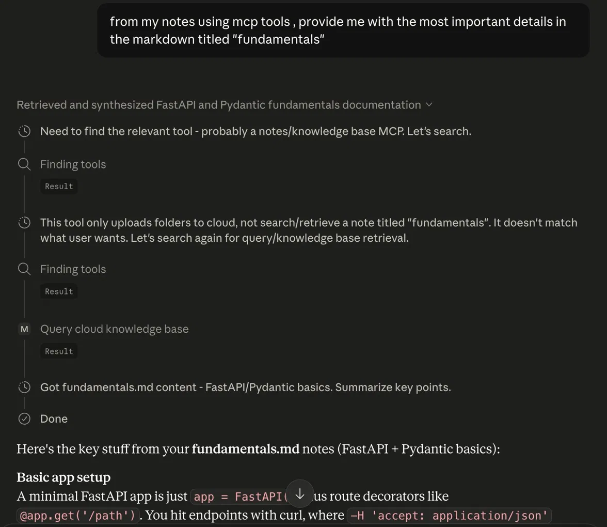

# CloudRAG-MCP

A Model Context Protocol (MCP) server built from scratch in async Python, 
backed by a Pinecone Assistant for cloud-based RAG (Retrieval-Augmented Generation).

This server speaks raw JSON-RPC 2.0 over stdin/stdout — no MCP SDK — handling 
the full request lifecycle (`initialize`, `tools/list`, `tools/call`) with a 
custom decorator-based tool registry that auto-generates JSON schemas from 
Python type hints.

## Features

- **Custom MCP protocol implementation** — async stdio transport using 
  `asyncio.StreamReader` / `StreamWriter`, with non-blocking writes via a 
  shared lock and `drain()`.
- **Decorator-based tool registry** — register any async function as an MCP 
  tool with `@server.tool()`; input schemas are auto-derived from function 
  signatures and type hints.
- **Pinecone Assistant integration** — connects to a Pinecone Assistant for 
  document storage and retrieval.
- **Cloud document ingestion** — scan a local folder and upload PDFs, TXT, 
  MD, and JSON files directly to the Pinecone Assistant for indexing.
- **Cloud RAG querying** — query the indexed knowledge base and return 
  formatted context snippets with source attribution.
- **Query optimization tool** — converts messy conversational prompts into 
  clean, keyword-optimized search queries before hitting the vector store.

## Tools

| Tool | Description |
|---|---|
| `calculate_area` | Simple demo tool — calculates rectangle area. |
| `greet_user` | Demo tool — formal/informal greeting based on a flag. |
| `optimize_search_query` | Rewrites a conversational prompt into an optimized search string. |
| `upload_local_folder_to_cloud` | Uploads supported files from a local folder to the Pinecone Assistant. |
| `query_cloud_knowledge_base` | Retrieves relevant context snippets from the Pinecone index for a given query. |

## Setup

1. Clone the repo and install dependencies:
```bash
   pip install aiohttp pinecone python-dotenv
```

2. Create a `.env` file in the project root:

Enter this into it , PINECONE_API_KEY=your_api_key_here

3. Make sure a Pinecone Assistant named `my-notes` already exists under your 
   API key (create one via the Pinecone console or API if you haven't). The 
   `ASSISTANT_NAME` constant controls which assistant/index is used — change 
   it to point at a different knowledge base.

4. Run the server:
```bash
   python server.py
```

## How it works

The server reads newline-delimited JSON-RPC messages from stdin, dispatches 
each request as an independent `asyncio` task, and writes responses back to 
stdout asynchronously. Tool calls are routed through a registry built at 
import time via the `@server.tool()` decorator, which inspects each function's 
signature to produce an MCP-compatible `inputSchema`.

On startup, the server attempts a best-effort check for the configured 
Pinecone Assistant and logs status to stderr; this check is non-blocking and 
won't prevent the server from starting even if it fails. The core tools 
(`upload_local_folder_to_cloud`, `query_cloud_knowledge_base`) make their own 
fully-awaited calls to the Pinecone API and require the assistant to already 
exist.

## Notes

- Designed to be wired into any MCP-compatible client (e.g. Claude Desktop, 
  custom LLM agent loops).
- All server logs go to stderr to keep stdout clean for JSON-RPC traffic.

## Demo

Claude (via Claude Desktop) automatically selecting and calling the right MCP 
tool to retrieve notes from the Pinecone-backed knowledge base:



> Claude searches available tools, rules out `upload_local_folder_to_cloud` 
> as a mismatch, finds `query_cloud_knowledge_base`, and retrieves real 
> content from the indexed `fundamentals.md` notes.